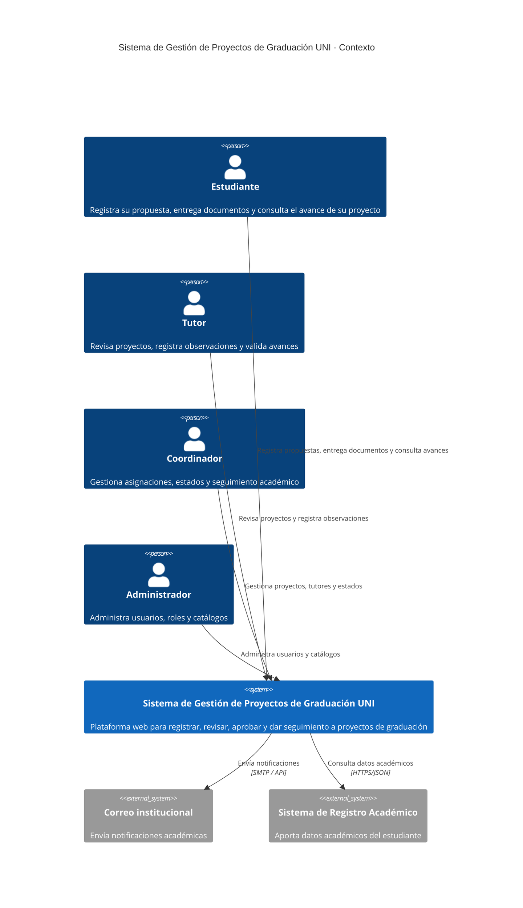

# Sistema de Gestión de Proyectos de Graduación UNI

Plataforma web para registrar, revisar, aprobar y dar seguimiento a proyectos de graduación de la Universidad Nacional de Ingeniería (UNI).

> Proyecto académico de la asignatura Diseño de Sistemas en Internet.

## Arquitectura

La arquitectura se documenta con el Modelo C4 (niveles 1 y 2), complementado con diagramas de secuencia que describen las interacciones API-First.

### C4 Nivel 1 - Contexto



### C4 Nivel 2 - Contenedores

```mermaid
(pega aquí el código del diagrama, sin las comillas triples del bloque de arriba)
```

| Contenedor | Tecnología | Responsabilidad |
|---|---|---|
| Aplicación Web | React | Interfaz de usuario y consumo de la API |
| API REST | ASP.NET Core Web API / C# | Autenticación, reglas de negocio y endpoints HTTP |
| Base de Datos | SQL Server | Persistencia de usuarios, proyectos, revisiones y estados |
| Gestor de Documentos | Almacenamiento de objetos | Archivos y evidencias del proyecto |

### Diagramas de secuencia

_Pendiente._

## API principal

_Pendiente._

## Cómo ejecutar el proyecto

_Pendiente._